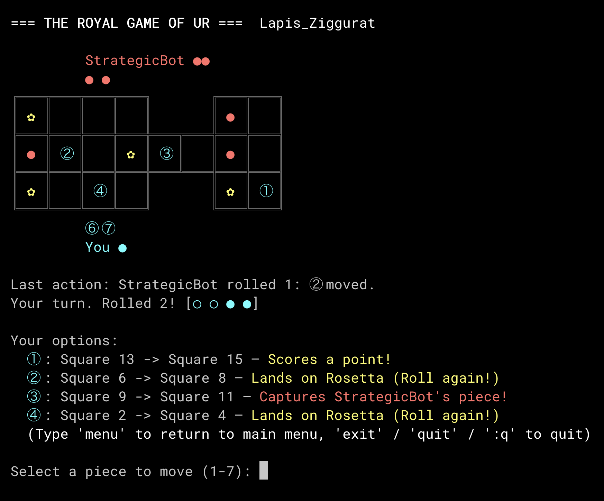

# 🎲 The Royal Game of Ur

[](https://opensource.org/licenses/MIT)
 


A dependency-free, terminal-based implementation of the oldest playable board game in recorded history. 

Written in pure Python, this project features a deeply object-oriented game engine, a custom TCP networking protocol for LAN multiplayer, auto-saving persistence, and intelligent AI opponents.

## 🏺 Historical Roots

The Royal Game of Ur is an ancient Mesopotamian board game dating back to **2600 BCE**. 

The physical game boards were originally discovered by English archaeologist Sir Leonard Woolley during his excavations of the Royal Cemetery at Ur (in modern-day Iraq) between 1922 and 1934. The original wooden boards were exquisitely crafted, inlaid with shell, red limestone, and lapis lazuli.

For decades, the boards sat in the British Museum as beautiful but unplayable artifacts. It wasn't until the 1980s that Dr. Irving Finkel, a British Museum curator and Assyriologist, successfully translated the rules of the game from a cuneiform clay tablet written by a Babylonian astronomer in 177 BCE. Thanks to his translation, this 4,600-year-old game is alive and playable once again.

[More on Wikipedia](https://en.wikipedia.org/wiki/Royal_Game_of_Ur)

## ✨ Features

* **Slick Terminal UI:** A beautiful, responsive ANSI-colored interface featuring asynchronous dice rolling animations, intuitive move highlighting, and a static ASCII grid template.
* **LAN Multiplayer:** Play across the room (or the world) using a custom, lightweight TCP protocol. Built on an authoritative-server model with a daemon-threaded background message queue, ensuring zero UI blocking or client-side desyncs.
* **Smart Bots:** Play against the computer or pit AIs against each other. Includes a `RandomBot`, a `GreedyBot`, and a mathematically-driven `StrategicBot` that calculates risk probabilities.
* **Robust Persistence:** Games auto-save after every turn with procedurally generated names (e.g., `Lapis_Ziggurat`, `Exiled_Scribe`). Disconnected from a LAN game? Just reload the save and keep playing.
* **Simulation Engine:** A dedicated runner to pit bots against each other over thousands of games, tracking win rates and average turns via precise dataclasses.

## 🚀 Quick Start

Because this project relies entirely on the Python Standard Library, there are **zero external dependencies**. 

### Installation

```bash
# 1. Clone the repository
git clone [https://github.com/tatterdemalion/ur.git](https://github.com/tatterdemalion/ur.git)

# 2. Navigate into the directory
cd ur

# 3. Install locally (optional, but sets up the 'ur' command)
pip install -e .
```

### Launching the Game

If you installed it via pip, you can launch the game from anywhere in your terminal:

```bash
ur
```

Otherwise, you can use the included Makefile or run it directly:

```bash
make play
# OR
python -m ur.play
```

### Running Bot Simulations
Want to see who wins in a 10,000 game tournament between the `StrategicBot` and the `GreedyBot`?

```bash
make simulate BOT1=StrategicBot BOT2=GreedyBot GAMES=10000
# OR
python -m ur.simulate StrategicBot GreedyBot --games 10000
```

*Add the `--show` flag (or run `make watch`) to watch them battle it out in the terminal in real-time.*

## 📜 How to Play

The rules follow the standard modern interpretation of the ancient Mesopotamian game:
1.  **Objective:** Race all 7 of your pieces across the board to the finish line before your opponent.
2.  **Movement:** Roll 4 binary dice each turn (yielding 0-4 spaces). 
3.  **Combat:** The middle row is a shared warzone. Landing on an opponent's piece captures it, sending it back to the start.
4.  **Rosettas (✿):** Landing on a Rosetta grants an immediate extra turn. The central Rosetta also acts as a safe haven where pieces cannot be captured.

## 🗺️ Roadmap

- [x] Engine & Entities
- [x] Bot Simulation Framework
- [x] LAN Multiplayer (Raw TCP Sockets)
- [x] Session Persistence (JSON Auto-saves)
- [ ] **Phase 3:** Machine Learning (Q-Learning bot trained over millions of self-play games)
- [ ] **Phase 4:** Online Multiplayer (WebSockets / FastAPI Backend)

## 📄 License

This project is licensed under the MIT License - see the LICENSE file for details.
